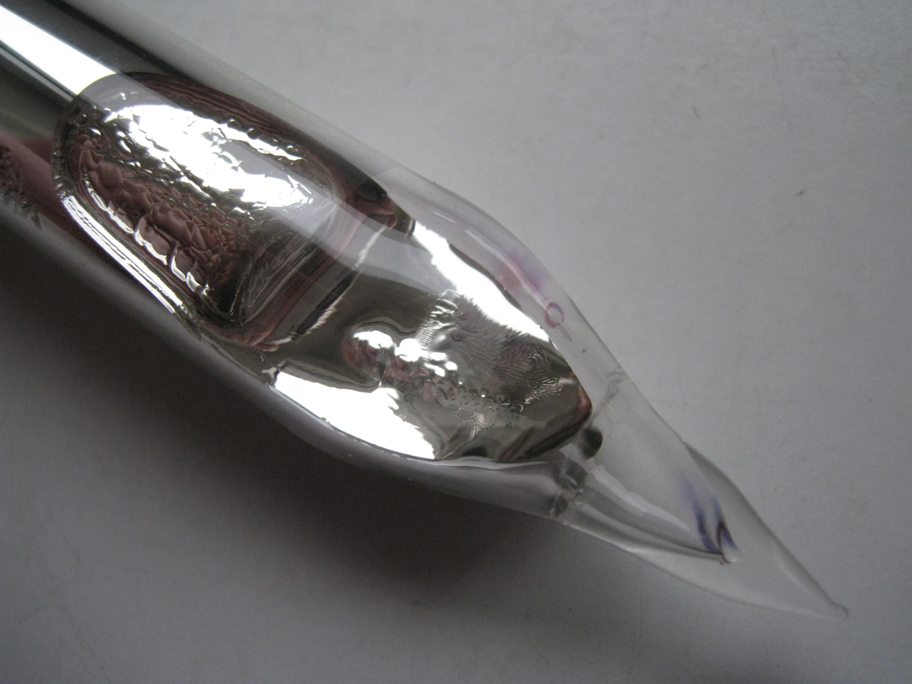
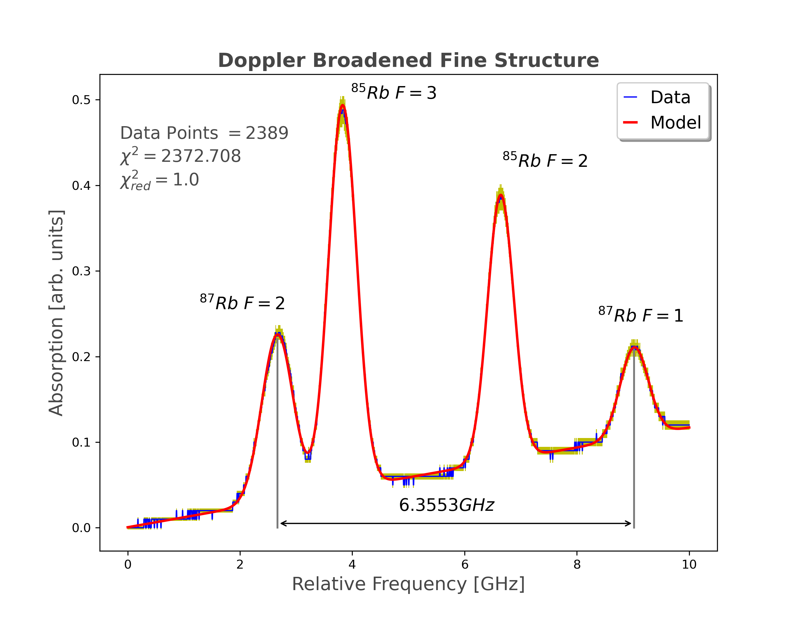

# DFFS
## Analyzing the Doppler Free Saturation Spectroscopy of Rubidium using Python

*Image credit [Dnn87](https://commons.wikimedia.org/wiki/User:Dnn87). This file is licensed under the [Creative Commons](https://en.wikipedia.org/wiki/en:Creative_Commons) [Attribution 3.0 Unported](https://creativecommons.org/licenses/by/3.0/deed.en) license.*

Rubidium(Rb) is part of the alkali metals and has atomic number 37. Alkali elements are characterized by a closed shell configuration of the inner electrons and a single valence electron which gives them a ”hydrogen-like” structure and properties.

The data for this study were collected in an actual lab setting.

The quantization of angular momentum has important implications for the energy levels of the hydrogen atom. For example, the energy levels of the hydrogen atom are split into multiple sublevels due to the different possible values of the electron's orbital angular momentum and spin angular momentum. This splitting of the energy levels is known as the fine structure of the hydrogen atom.

To detect the fine and hyperfine splitting of energy levels by spectroscopy, we can use a spectrometer to measure the spectrum of the atom or molecule of interest. A spectrometer is an instrument that measures the wavelength or frequency of electromagnetic radiation.

*Actual image from the experiment showing the laser beam passing through the rubidium cell.*

When an atom or molecule absorbs a photon of energy, it can be excited to a higher energy level. When the atom or molecule then decays back to a lower energy level, it emits a photon of energy. The wavelength or frequency of the emitted photon is characteristic of the energy difference between the two energy levels.

The fine and hyperfine splitting of energy levels can be detected by measuring the spectrum of the emitted photons. For example, if we excite a hydrogen atom to a higher energy level, it will emit a photon of energy when it decays back to the ground state. However, due to the fine and hyperfine splitting of the energy levels, the emitted photon can have multiple different wavelengths.

To measure the spectrum of the emitted photons, we can use a spectrometer. The spectrometer will separate the photons into different wavelengths, and we can then measure the intensity of the photons at each wavelength. The resulting spectrum will show multiple peaks at different wavelengths, corresponding to the different fine and hyperfine structure components of the spectral line.

*The Gaussian fit to the Doppler broadened signal
showing the frequency separation between the Rubidium-87 F=1 and
F=2 levels.*

